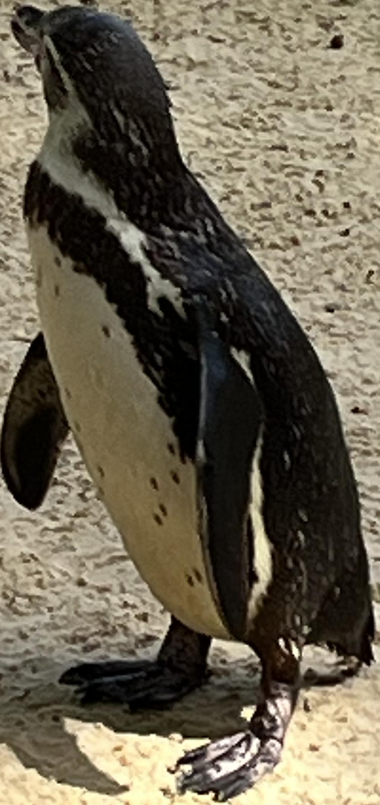
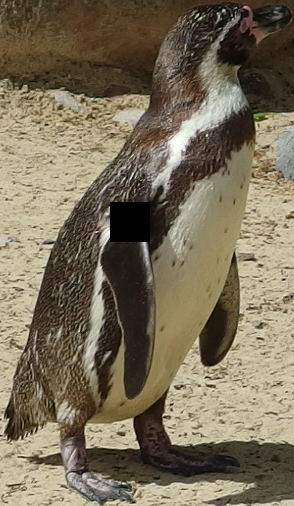
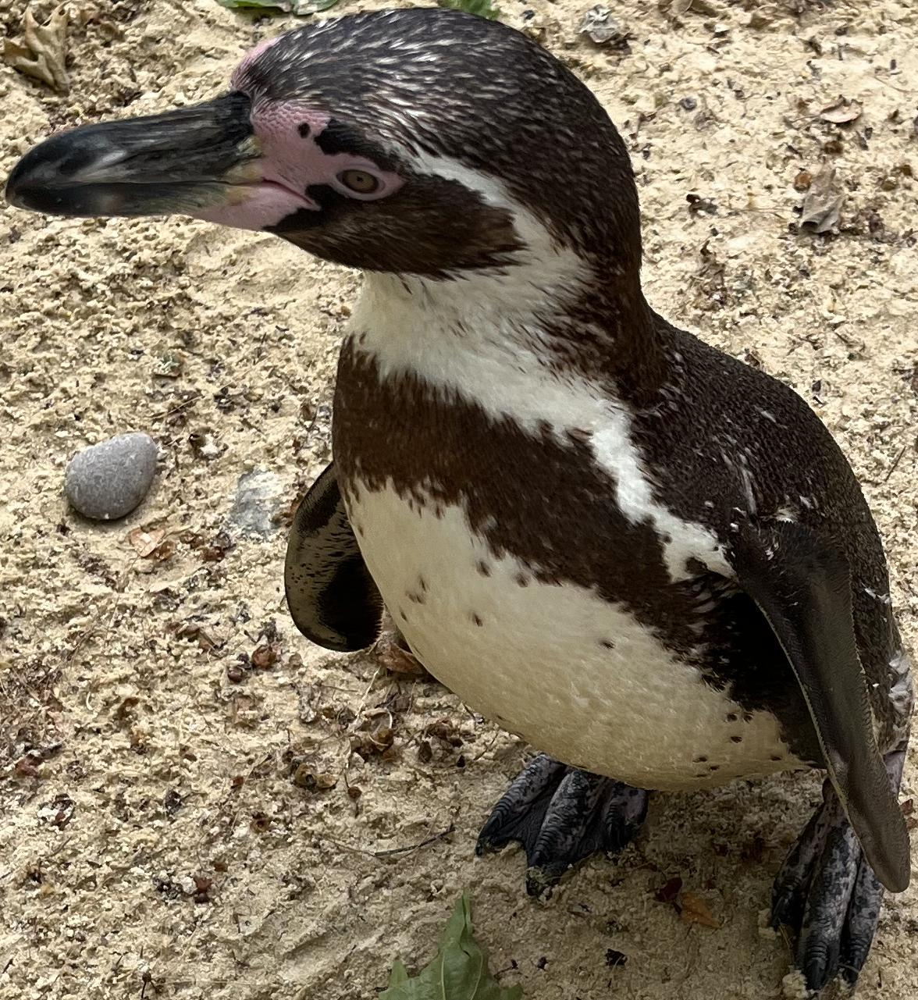
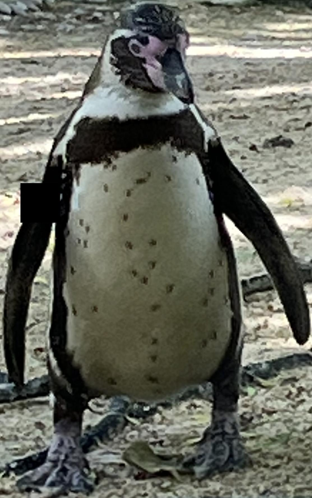
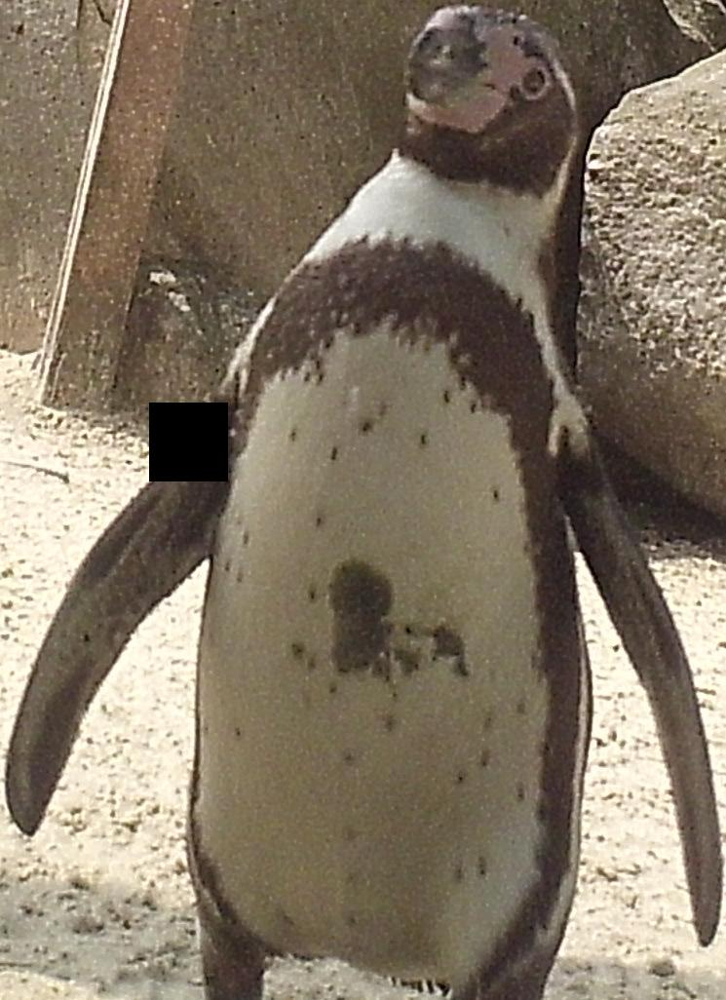
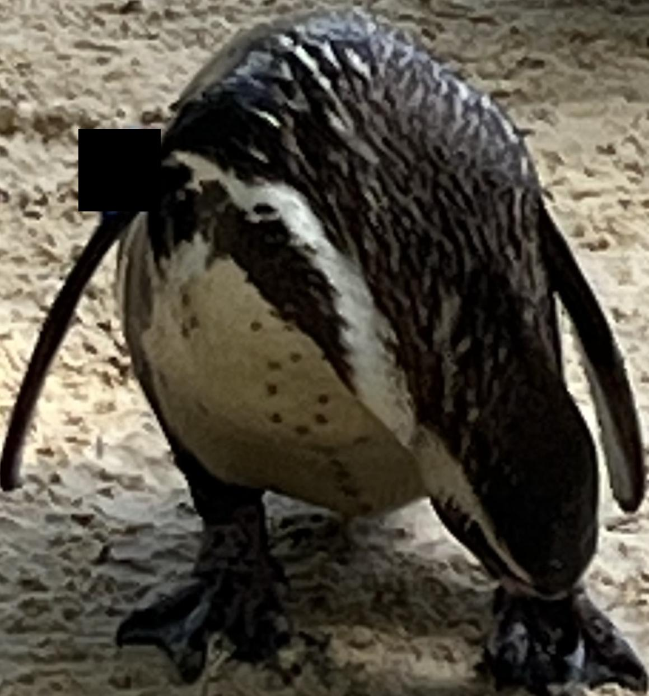

# Banded Penguin Identification Project 

This Document summarises the workflow and scripts of the python project behind the research and application of my (Theo McLaurin's) MRes masters research project.

The Project aimed to build and train a computer vision embedding model that could
identify individual Banded Penguins (Spheniscus) from manual photographs and camera traps.
I aimed to build a model that could work with variation across age, pose and image quality.
Testing shows that the final model weights were capable of solving the open-set 
recognition problem commonly dealt with by conservation technologists. 

## Build a database and Train models
This is a step by step process to recreate the process undertaken by me to build and train a convolutional neural network to identify individual Banded Penguins from photos. A large source of inspiration was the work done by Olga Moskvyak (https://github.com/olgamoskvyak) on Manta Rays. This approach is generalisable to any and all open-set re-identification tasks, not just the species studied by Olga and I. For the rest of this tutorial I will assume you are working with a species of Banded penguin. 

**Pre-requisites**

You will need a database of Known Individuals, and photos of them across a wide variety of poses and environments. There is no rule about how many identities and how many photos is necessary, however the more the better. I utilised easy access to a known population of Humboldt penguins at ZSL London Zoo to build a database of 2219 images of 81 individuals. This database should exist as a directory of IDs, each ID containing the images of that individual. I used MegaDetector to identify and extract individuals from larger images. 

**Megadetector and Extracting Instances**
We can isolate and centre each individual and remove as much extraneous background as possible by running Megadetector, an off the shelf animal detecting model and then using the outputted json file to detections to crop each instance. 

Megadetector v5
```bash
python -m megadetector.detection.run_detector_batch MDV5A \
  "path/to/input_photos" \
  "path/to/output.json" \
  --output_relative_filenames \
  --recursive \
  --checkpoint_frequency 10000 \
  --quiet
```
crop.py -- Takes the input photos and the output.json from megadetector. Produces cropped out detections from the original images above a set confidence threshold. Takes arguments as flags. 

**Occluding Tags**

My Zoo housed subjects had identifying wing bands, for which I build a duplicate second dataset that had these tags covered by a black square in order to focus the model on the features of the penguin and help it transfer to applications on wild populations. 

tag_occluder.py - Runs a GUI that displays one image at time from the source directory. Shift and Option keys toggle the size of the occluding square. Each photo is duplicated and stored in the destination directory in the same structure. The Progress and metadata is saved in a csv file so that the (often tedious) process is saved, the script can be quit and returned to and it will resume progress. 

**Example Images**

This table contains Mega-detected, cropped, tag-ocluded, images of one identity; showcasing the varation in pose, background and source that we want the model to become robust to. 
<table>
  <tr>
    <td></td>
    <td></td>
    <td></td>
  </tr>
  <tr>
    <td></td>
    <td></td>
    <td></td>
  </tr>
  <tr>
    <td></td>
    <td></td>
    <td></td>
  </tr>
</table>


**Histogram Normalisation**

Pre-processing the images with Histogram Normalisation often makes the image dataset reduces the variability of image characteristics and increases the contrast. This has often been found to assist computer vision models, however I found that it had no effect on model performance for my identification models. 

database_preprocess.py - Duplicates the content and structure of a database and applies histogram normalisation to all images.

**Split the Dataset**

We need to delineate photos that are to be used to train the model and to test the model. I perform two tests using photos that the model hasn't seen before, one on individuals it has seen before and one on individuals it hasn't seen before. As such we need to first divide the individuals into "known" and "unknown" and then the "known" individuals into test and train. I set the identities with the fewest images to be the unknown set, which may not be suitable for your dataset. 

create_tf_data_csv.py -- Reads the image dataset and creates an unknown/known based on the number of images of the identity and then test/train dataset split written to a csv file. The file contains pathnames and the aforementioned labels. 

**Perform a model training hyper-parameter grid-search**

We can now train our models. The hyper-parameter grid search accepts a large number of paramter variables, but takes a simple approach of training each combination to completion. The variables that can be explored and the best values I found were: 

| Parameter      | Function                                  | Best Values |
|----------------|-------------------------------------------|-------------|
| LEARNING_RATE  | Head-only Learning rate                   |1e-04        |
| LEARNING_RATE_2| Head and Backbone Learning rate           |2e-05        |
| MARGIN         | Triplet Loss Margin                       |0.1, 0.5     |
| WARMUP_LENGTH  | Epochs run before unfreezing the Backbone |5, 15        |
| DROPOUT_RATE   | Dropout Rate for the Head                 |0, 0.1       |

train_gridsearch.py -- Runs a parameter grid-search of training variables. Produces model weights from each combination. Prints progress as it runs. Outputs a csv file of model performances at the the ability to match test images to known "gallery" images in K guesses (gallery_topN_accuracies[k]), and the ability to match pairs of images of unknown identities (mAP_at_1).

## Visualising the Results

**Visualise the Embedding space created by a model**

updated_visualise_embeddings.py
Monochrome t-SNE visualisation of embeddings, from a directory of images.

colour_visualise_embeddings.py
t-SNE visualisation of embeddings, coloured according to dataset split metadata, from a directory of images.

medoid_poles_vis_embeddings.py
Embeds, labels key points, and visualises a folder of images. Returns file paths of key photos: The medoid; most central image, the first pole; furthest image from the medoid, second pole; the furthest image from the first pole. 

## Using the model 

**Performing a Population Estimation**

We can use a trained model to perform a very simple population estimation. We can cluster a set of images into identities by comparing each image to it's nearest neighbour and deciding that it's a new identity if it's beyond a certain threshold. We can run this over our known dataset to see which threshold value returns the right population estimate, and then applying that to a set of unknown images. Despite the simplicity of this approach, a model trained on the Humboldt Penguins at ZSL London Zoo produced a good population estimate of the African Penguins at ZSL Whipsnade Zoo. 

pop_est_test.py
Visualises the population estimate and error rates across a range of threshold values for a known set of images.

unlabelled_pop_est_test.py
Visualises the population estimates across a range of threshold values for an unknown set of images.


## Complete Glossary of Scripts 

Main Scripts

crop.py
Copies and produces crops from images using MegaDetector bounding boxes.

database_preprocess.py
Copies and applies histogram normalisation to a directory of images, retaining the same organisational structure.

medoid_poles_vis_embeddings.py
Embeds, labels key points, and visualises a folder of images. Returns file paths of key photos.

model.py
Defines the build_embedding_model function.

pop_est_test.py
Visualises the population estimate and error rates across a range of threshold values for a known set of images.

unlabelled_pop_est_test.py
Visualises the population estimates across a range of threshold values for an unknown set of images.

tag_occluder.py
GUI for the manual application of black squares to occlude tags from images. Produces a copy of the input directory with the same structure. Can be saved.

train_gridsearch.py
Performs a grid search across hyper-parameters and a model on each variation to an adaptive stopping point.
Requires a CSV of dataset split metadata and training data.
Returns model weights and a CSV of training and validation metrics.

updated_visualise_embeddings.py
Monochrome t-SNE visualisation of embeddings, from a directory of images.

colour_visualise_embeddings.py
t-SNE visualisation of embeddings, coloured according to dataset split metadata, from a directory of images.

validate_crops.py
Copies and sorts images into valid and invalid subdirectories according to the judgement of a loaded binary image classifier and the set threshold.

Utils

create_tf_data_csv.py
Creates a CSV file of train, test, and validation metadata labels for a directory of images.

mining.py
Provides various functions for generating triplets.

augmentation.py
Provides various image augmentation functions.
